# Authorization Flow - WebView ↔ Native

## 🔐 Problem Statement

**Issue:** Web app di WebView tidak bisa akses Supabase karena tidak ada session/token.

**Why?** Supabase client di web app dibuat sekali saat init, tapi tidak menggunakan token yang di-inject dari mobile app.

---

## ✅ Solution: Token Injection & Session Management

### **1. Mobile App Injects Token**

```typescript
// ct-mobile-app/app/(tabs)/chapter7.tsx
const injectedJavaScript = `
  (function() {
    window.__IS_EMBEDDED__ = true;
    window.__NATIVE_AUTH_TOKEN__ = '${accessToken}';  // ← Inject token
    window.__IS_GAMIFIED__ = ${isGamified};
    true;
  })();
`
```

**Token Source:**
```typescript
const { data: { session } } = await supabase.auth.getSession()
const accessToken = session?.access_token
```

---

### **2. Web App Sets Token to Supabase Client**

```typescript
// computational-thinking-app/src/lib/supabase.ts

export const supabase = createClient(supabaseUrl, supabaseAnonKey, {
    auth: {
        persistSession: false,  // Don't persist - we get from native
        autoRefreshToken: false // Native handles refresh
    }
})

export async function setAuthTokenFromNative() {
    const token = window.__NATIVE_AUTH_TOKEN__
    
    if (token) {
        const { data, error } = await supabase.auth.setSession({
            access_token: token,
            refresh_token: ''  // Native handles refresh
        })
        
        if (!error) {
            console.log('✅ Auth token set')
            console.log('👤 User:', data.user?.email)
            return true
        }
    }
    return false
}
```

---

### **3. Call on Component Mount**

```typescript
// Chapter7Page.tsx
useEffect(() => {
    if (isEmbedded && isWebView()) {
        setAuthTokenFromNative().then((tokenSet) => {
            console.log('🔐 Auth:', tokenSet ? '✅' : '❌')
        })
    }
}, [isEmbedded])
```

---

## 🔄 Complete Flow Diagram

```mermaid
sequenceDiagram
    participant User
    participant Mobile as Mobile App
    participant Storage as AsyncStorage
    participant Supabase as Supabase Auth
    participant WebView
    participant WebApp as Web App

    User->>Mobile: Login with email/password
    Mobile->>Supabase: signInWithPassword()
    Supabase-->>Mobile: Return session + access_token
    Mobile->>Storage: Save session
    
    Note over Mobile: User navigates to Bab 7
    
    Mobile->>Storage: Load session
    Storage-->>Mobile: Return session
    Mobile->>Mobile: Extract access_token
    
    Mobile->>WebView: Inject JavaScript
    Note right of WebView: window.__NATIVE_AUTH_TOKEN__ = 'eyJhbG...'
    
    WebView->>WebApp: Load /embed/chapter7
    WebApp->>WebApp: Read window.__NATIVE_AUTH_TOKEN__
    WebApp->>WebApp: Call setAuthTokenFromNative()
    WebApp->>Supabase: setSession(access_token)
    Supabase-->>WebApp: Session established ✅
    
    Note over WebApp: Now authorized!
    
    WebApp->>Supabase: logActivity(userId, ...)
    Supabase-->>WebApp: Success ✅
```



---

## 🎯 Benefits

### **1. Single Sign-On (SSO)**
- ✅ User login sekali di mobile
- ✅ Token auto-inject ke WebView
- ✅ No double login required

### **2. Secure**
- ✅ Token tidak disimpan di web localStorage
- ✅ Session managed by native app
- ✅ Token refresh handled by mobile

### **3. Seamless UX**
- ✅ User tidak aware ada 2 sistem
- ✅ Transparent authentication
- ✅ Same permissions as mobile

---

## 🔍 Debugging

### **Check Token Injection (Mobile Side)**

```typescript
// In mobile app console
console.log('Token:', accessToken ? 'Present' : 'Missing')
console.log('Length:', accessToken?.length)
```

### **Check Token Reception (Web Side)**

Open Chrome DevTools → Console (when WebView running):

```javascript
// Check if token injected
console.log('Token:', window.__NATIVE_AUTH_TOKEN__)

// Check if Supabase session set
const { data } = await window.supabase.auth.getSession()
console.log('Session:', data.session ? 'Active' : 'None')
console.log('User:', data.session?.user?.email)
```

### **Test Authorization**

```javascript
// Try to fetch protected data
const { data, error } = await window.supabase
  .from('profiles')
  .select('*')
  .single()

console.log('Profile:', data ? 'Accessible ✅' : 'Unauthorized ❌')
```

---

## 🚨 Common Issues & Solutions

### **Issue 1: Token not found**
```
⚠️ No native auth token found
```

**Cause:** Session expired atau belum login di mobile

**Solution:**
1. Logout dari mobile app
2. Login kembali
3. Navigate ke Bab 7

---

### **Issue 2: Token invalid**
```
❌ Error setting auth token: Invalid token
```

**Cause:** Token format salah atau corrupted

**Solution:**
1. Check injected JS syntax
2. Ensure proper string escaping
3. Verify token dari Supabase valid

---

### **Issue 3: RLS policy error**
```
Error: new row violates row-level security policy
```

**Cause:** Supabase RLS enabled tapi token tidak di-set

**Solution:**
1. Ensure `setAuthTokenFromNative()` dipanggil sebelum DB call
2. Check logs: "✅ Auth token set from native injection"
3. Verify RLS policies di Supabase dashboard

---

## 📊 Session Lifecycle

```
┌─────────────────────────────────────────────────┐
│           Mobile App Session                    │
│  ┌───────────────────────────────────────────┐  │
│  │  AsyncStorage                             │  │
│  │  - access_token                           │  │
│  │  - refresh_token                          │  │
│  │  - expires_at                             │  │
│  └───────────────────────────────────────────┘  │
│                      │                          │
│                      ▼                          │
│  ┌───────────────────────────────────────────┐  │
│  │  Auto-refresh by Supabase client          │  │
│  │  (when token expires)                     │  │
│  └───────────────────────────────────────────┘  │
│                      │                          │
│                      ▼                          │
│  ┌───────────────────────────────────────────┐  │
│  │  Inject fresh token to WebView            │  │
│  └───────────────────────────────────────────┘  │
└─────────────────────────────────────────────────┘
                       │
                       ▼
┌─────────────────────────────────────────────────┐
│           WebView Session                       │
│  ┌───────────────────────────────────────────┐  │
│  │  Temporary (not persisted)                │  │
│  │  Set via supabase.auth.setSession()       │  │
│  │  Valid only during WebView session        │  │
│  └───────────────────────────────────────────┘  │
└─────────────────────────────────────────────────┘
```

**Key Points:**
- Mobile session is **persistent** (AsyncStorage)
- WebView session is **temporary** (memory only)
- Token re-injected every time WebView loads
- Mobile handles refresh, WebView gets fresh token

---

## 🎓 Best Practices

### **1. Always Check Token Before API Calls**
```typescript
const tokenSet = await setAuthTokenFromNative()
if (!tokenSet) {
    console.error('Cannot proceed without auth')
    return
}

// Now safe to call API
await logActivity(...)
```

### **2. Handle Token Expiry Gracefully**
```typescript
try {
    await supabase.from('activity_logs').insert(...)
} catch (error) {
    if (error.code === 'PGRST301') { // Auth error
        // Ask native to refresh
        sendToNative({ type: 'REFRESH_TOKEN_NEEDED' })
    }
}
```

### **3. Don't Store Token in Web App**
```typescript
// ❌ BAD - Don't do this
localStorage.setItem('token', token)

// ✅ GOOD - Get from native every time
const token = window.__NATIVE_AUTH_TOKEN__
```

---

## 📝 Summary

| Aspect | Mobile App | Web App |
|--------|-----------|---------|
| **Auth Storage** | AsyncStorage (persistent) | Memory only |
| **Token Source** | Supabase Auth | Injected from native |
| **Session Management** | Full control | Read-only |
| **Token Refresh** | Auto by Supabase | Handled by native |
| **Logout** | Clear AsyncStorage | Just close WebView |

**Result:** ✅ Seamless SSO experience with secure token management!

