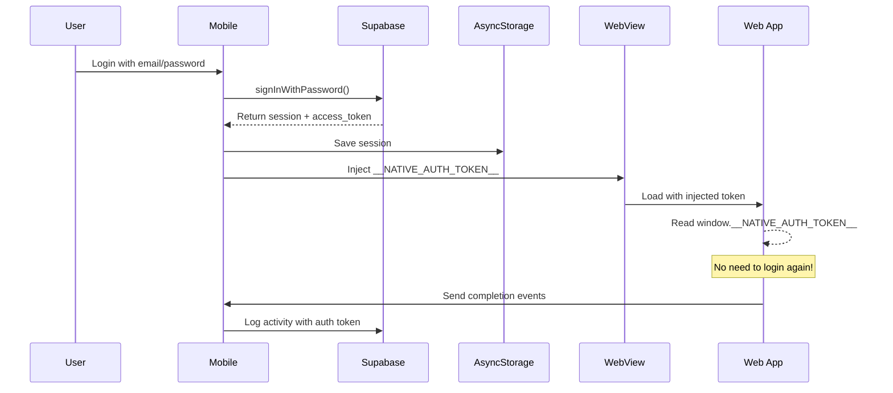

# WebView Architecture - Minimalist Game Renderer

## 📐 Arsitektur

```
┌─────────────────────────────────────────────────────┐
│           React Native Mobile App                   │
│  ┌───────────────────────────────────────────────┐  │
│  │  Dashboard, Progress, XP, Stats               │  │
│  │  (Native Components)                          │  │
│  └───────────────────────────────────────────────┘  │
│                      │                              │
│                      ▼                              │
│  ┌───────────────────────────────────────────────┐  │
│  │          WebView (Embedded)                   │  │
│  │  ┌─────────────────────────────────────────┐  │  │
│  │  │   Web App: Game Renderer Only          │  │  │
│  │  │   - Blockly Workspace                  │  │  │
│  │  │   - Visual Stage (Canvas)              │  │  │
│  │  │   - Minimalist UI                      │  │  │
│  │  └─────────────────────────────────────────┘  │  │
│  └───────────────────────────────────────────────┘  │
│                      │                              │
│              ┌───────┴───────┐                      │
│              │ Bridge Layer  │                      │
│              │ (postMessage) │                      │
│              └───────────────┘                      │
└─────────────────────────────────────────────────────┘
```

## 🎯 Separation of Concerns

### Mobile App (React Native)
**Tanggung Jawab:**
- ✅ Authentication & Session Management
- ✅ Dashboard & Navigation
- ✅ Progress Tracking & Analytics
- ✅ XP Calculation & Gamification Stats
- ✅ Activity Logging ke Supabase
- ✅ User Profile & Settings

**Tidak Ada:**
- ❌ Game Logic
- ❌ Blockly Workspace
- ❌ Visual Programming Canvas

### Web App (React + Vite)
**Tanggung Jawab:**
- ✅ Game Rendering (Blockly + Canvas)
- ✅ Visual Programming Interface
- ✅ Block Code Execution
- ✅ Sprite Animation

**Tidak Ada:**
- ❌ Authentication (uses token from native)
- ❌ Progress Tracking (sends events to native)
- ❌ XP Calculation (native handles it)
- ❌ Dashboard/Navigation (embedded view only)

## 🔌 Bridge Communication

### Native → Web (Injection)
```typescript
// Injected saat WebView load
window.__IS_EMBEDDED__ = true
window.__NATIVE_AUTH_TOKEN__ = 'eyJhbGc...'
window.__IS_GAMIFIED__ = true
```

### Web → Native (postMessage)
```typescript
// Web app sends events
window.ReactNativeWebView.postMessage(JSON.stringify({
  type: 'ACTIVITY_COMPLETE',
  data: {
    score: 10,
    timeSpent: 120
  }
}))
```

### Native Handles Events
```typescript
// Mobile app receives and processes
handleMessage(event) {
  const message = JSON.parse(event.nativeEvent.data)
  
  switch (message.type) {
    case 'ACTIVITY_COMPLETE':
      // Update XP
      addXP(message.data.score)
      // Log to Supabase
      logActivity(userId, 'chapter7', message.data.timeSpent, ...)
      break
  }
}
```

## 🎨 Minimalist Embedded View

### What's Removed in Embedded Mode:
- ❌ Navigation header & back button
- ❌ Learning objectives section
- ❌ Challenge cards (native app shows this)
- ❌ Tips section
- ❌ Timer display (native tracks time)
- ❌ Heavy animations (fade-in, slide, etc)
- ❌ Gamification UI (XP badges, etc)

### What's Kept:
- ✅ Blockly workspace (essential)
- ✅ Visual stage canvas (essential)
- ✅ Execute/Reset buttons (essential)
- ✅ Minimal borders & spacing
- ✅ Responsive layout

## 🔐 Authentication Flow



**Keuntungan:**
1. ✅ User **gak perlu login 2x**
2. ✅ Session **persistent** di mobile (AsyncStorage)
3. ✅ Web app **stateless** - cuma renderer
4. ✅ Auth token **auto-inject** setiap WebView load

## 📊 Data Flow

```
User completes activity
        ↓
Web App calculates score
        ↓
postMessage to Native
        ↓
Native receives event
        ↓
Update local XP (Zustand)
        ↓
Log to Supabase
        ↓
Update dashboard UI
```

## 🚀 Performance Optimizations

### Web App (Embedded)
```typescript
// Minimal bundle
- No routing library overhead (single embed route)
- No auth library (uses injected token)
- No analytics (native handles)
- No dashboard components
- CSS: Only essential styles

// Fast load
- Vite's optimized build
- Tree-shaking unused code
- Lazy load Blockly
- CDN delivery via Vercel
```

### Mobile App
```typescript
// Efficient WebView
- Cache enabled
- JavaScript optimized
- No unnecessary reloads
- Background caching
```

## 📱 Routes

### Web App Routes:
```
/ → Full dashboard (for web users)
/chapter2 → Full page with nav
/chapter7 → Full page with nav
/embed/chapter7 → Minimalist game only (for mobile WebView)
```

### Mobile App:
```typescript
<WebView source={{ uri: 'https://ct-app-tan.vercel.app/embed/chapter7' }} />
```

## 🎮 Use Cases

### Scenario 1: User plays in Mobile App
1. User opens mobile app
2. Already logged in (session in AsyncStorage)
3. Navigate to "Bab 7"
4. WebView loads `/embed/chapter7`
5. Token auto-injected
6. Play game
7. Complete → postMessage to native
8. Native updates dashboard
9. **No double login required!** ✅

### Scenario 2: User plays in Web Browser
1. User opens web browser
2. Navigate to website
3. Login required (no native injection)
4. Full dashboard available
5. Can play all modules
6. Progress saved to Supabase

## 🔧 Development Workflow

### Local Testing:
```bash
# Web App
cd computational-thinking-app
npm run dev  # localhost:5173

# Mobile App
cd ct-mobile-app
# Edit chapter7.tsx
const WEB_APP_BASE_URL = 'http://YOUR_IP:5173/'  # For local testing
npm start
```

### Production:
```bash
# Deploy web app
cd computational-thinking-app
npm run build
# Vercel auto-deploy from Git

# Update mobile app
const WEB_APP_BASE_URL = 'https://ct-app-tan.vercel.app/'
```

## 🎯 Benefits of This Architecture

1. **📦 Separation of Concerns**
   - Mobile = UX, auth, tracking
   - Web = Game rendering
   
2. **🔄 Easy Updates**
   - Update game → just redeploy web app
   - No mobile app store approval needed
   
3. **🎨 Consistent Experience**
   - Same game across platforms
   - Web users can also play
   
4. **🚀 Performance**
   - Minimal embedded view
   - Fast load times
   - No redundant code
   
5. **🔐 Security**
   - Single source of truth (Supabase)
   - Token-based auth
   - No duplicate sessions

## 💡 Key Takeaways

- ✅ Web app cuma renderer game
- ✅ Mobile app handle semua logic bisnis
- ✅ User login sekali di mobile
- ✅ Token auto-inject ke WebView
- ✅ Event-driven communication
- ✅ Minimalist = Fast loading
- ✅ No unnecessary animations

